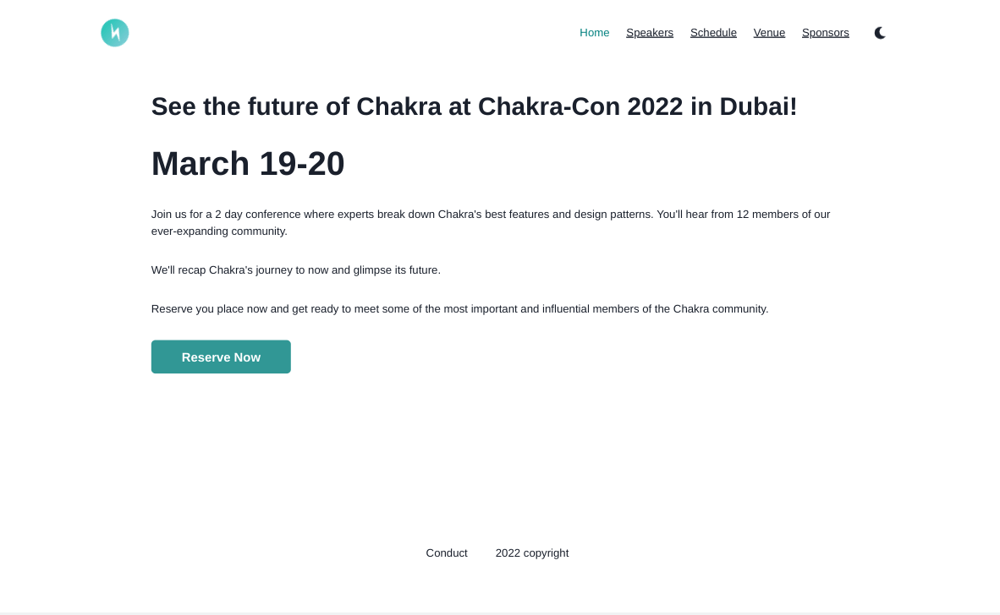
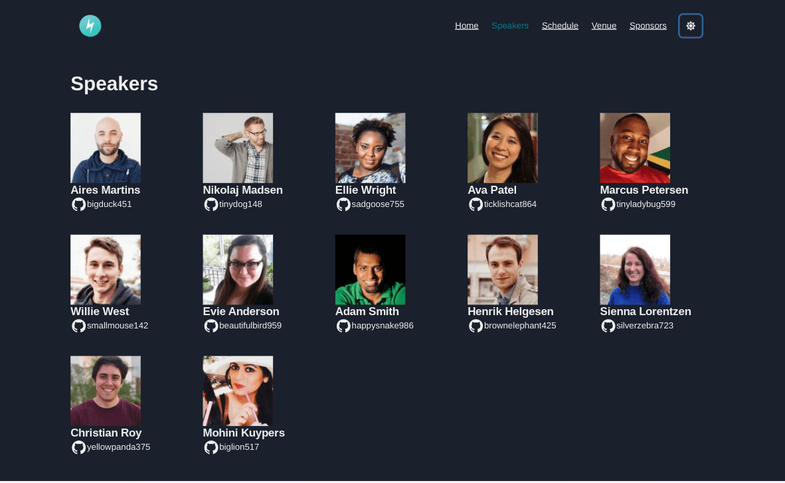
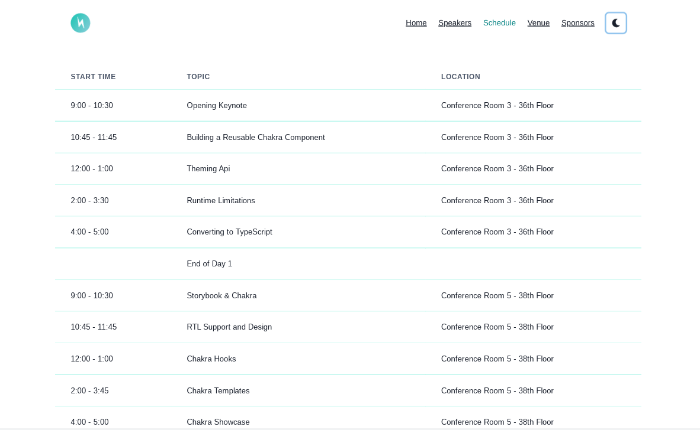
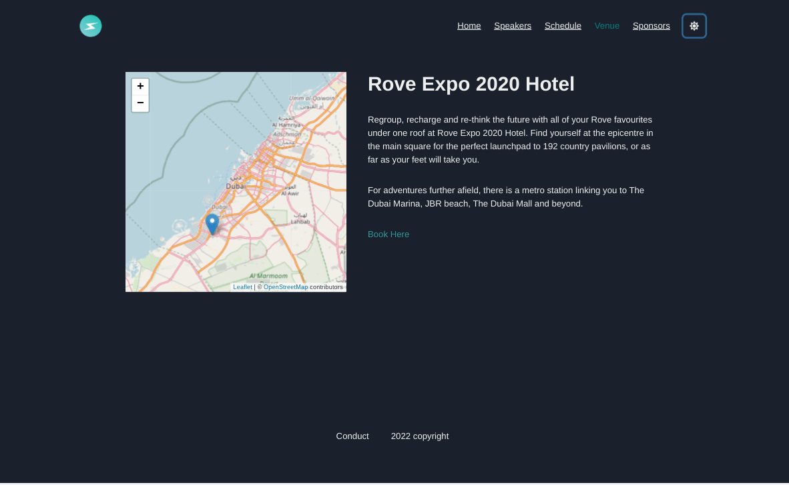
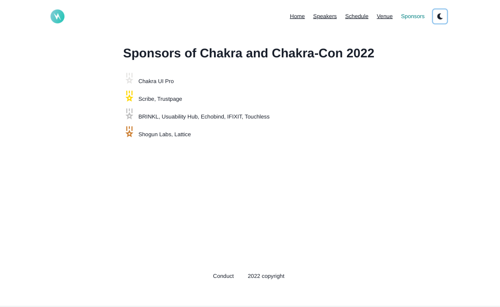
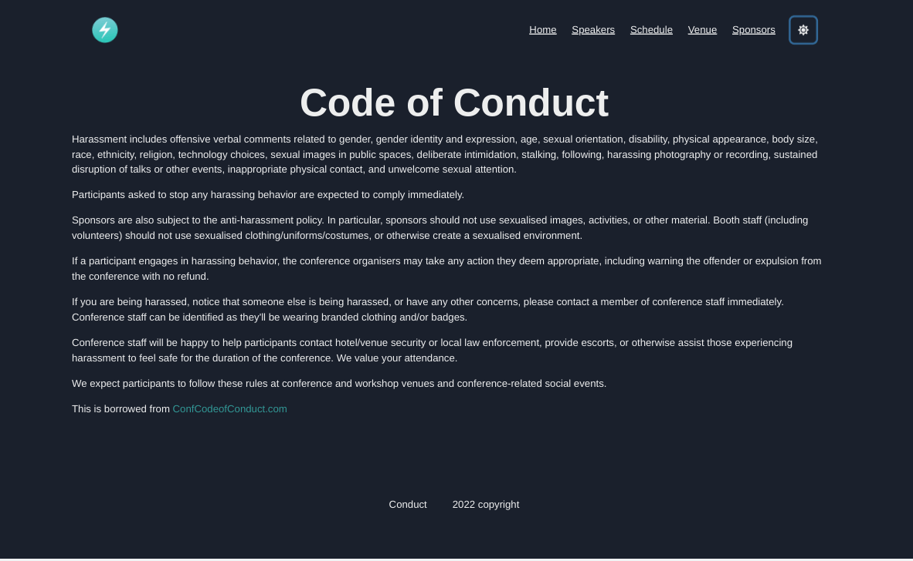
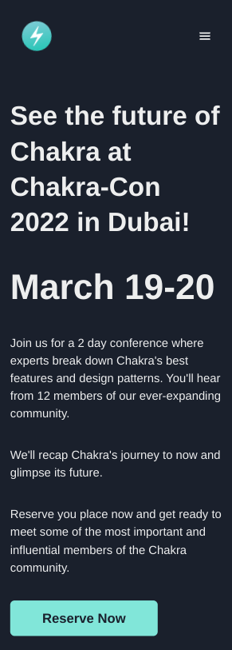
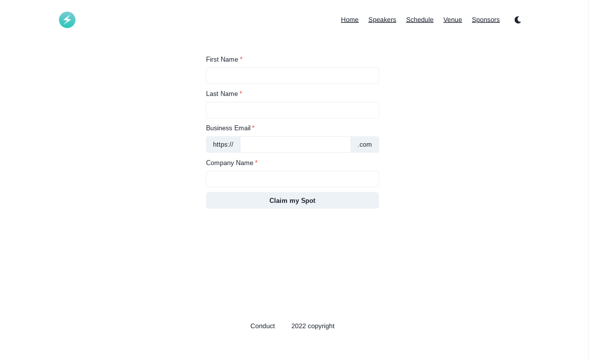
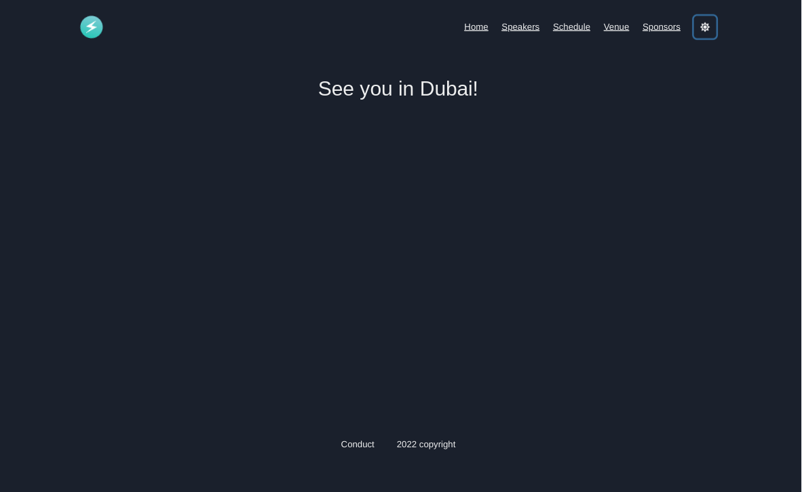

<h1 align="center">React Conference Schedule</h1>

   Solution to a challenge from <a href="https://50reactprojects.com/" target="_blank">50 react projects for the static web</a>.

## Table of Contents

- [Overview](#overview)
  - [Built With](#built-with)
  - [Thoughts](#thoughts)
- [Requirements](#requirements)
- [Improvements](#improvements)
- [Useful Resources](#useful-resources)

## Overview

[Live Link](https://jdegand.github.io/chakra-conf)

### Built With

- React
- React Router 
- randomuser.me api
- Leaflet & React-Leaflet

### Thoughts

- Originally, wanted to use a different library for each route and have those libraries be the sponsors of the fake conference.

- No real standout React table libraries.  

- Wanted to do a Gantt chart like the ember conference page but hard to find good examples 
- The ember site did not use D3 etc and used css alone to make its chart
- Seemed like a timesink til I explored alternatives and found no easy paste and customize solution

- To use D3 and React, best solution seems to be use D3 to make the chart inside a useEffect and return a svg with a ref to that chart 

- I had abandoned a project that integrated D3 and React before - With hooks, it is slightly easier but still documentation and examples are scarce beyond basic chart types

- Chakra & React Router issues with Link - to use both - have to alias one - Or not supposed to use both? 
- Chakra Docs show using "as" prop to get functionality 
  - import Link as RouterLink from 'react-router-dom'
  - Link as={RouterLink}
- Have to explore Chakra and React Router problems / tips 

- Will be looking into Strapi more even though I will not convert this to use a CMS

## Requirements

- [x] Create a multi-page website that includes all of the basic information about the new conference.
- [ ] Add a list of speakers to the homepage and create a schedule that lists each speaker with a talk and time.
- [ ] Set up a CMS and source the content of the website with that system.

## Improvements

- Performance
- Local Storage to save speakers
- Customize the theme
- Use google maps instead of Leaflet - Chakra docs has an example
- Skip to main content link - does Chakra provide ? 
- Improve Form and look into Chakra forms and validation
 
### Useful Resources

- [Random User API](https://randomuser.me/) 
- [Conf Code of Conduct](https://confcodeofconduct.com/)
- [Ember Conf](https://2019.emberconf.com/schedule.html) - 2019 ember conference
- [LatLong](https://www.latlong.net/) - Latitude and Longitude Finder
- [Blog](https://blog.bitsrc.io/top-5-react-table-libraries-170505f75da7) - react table libraries
- [Blog](https://blog.logrocket.com/the-top-react-table-libraries-to-use-in-2021/) - react table libraries
- [Retool](https://retool.com/blog/building-a-react-table-component/) - React Table tutorial
- [Github](https://github.com/SergeyDragunov/react-scheduler-table) - React Scheduler Table
- [Stack Overflow](https://stackoverflow.com/questions/56002784/any-example-for-gantt-chart-using-d3-js-in-react-js-either-with-d3-js-or-react-j) - D3 Gantt
- [Authentise](https://www.authentise.com/post/gantt-chart-with-react-js-and-d3-js) - Gantt 
- [Github](https://github.com/pigment/fake-logos) - Fake Logos
- [Blog](https://blog.logrocket.com/react-leaflet-tutorial/) - React leaflet tutorial
- [Stack Overflow](https://stackoverflow.com/questions/18589621/setting-map-language-to-english-in-openstreetmap-with-leafletjs) - Leaflet js & local language 
- [Open Collective](https://opencollective.com/chakra-ui/expenses/50382) - Chakra UI expenses for a meetup
- [Open Street Map](https://openstreetmap.be/en/projects/howto/leaflet.html) - Leaflet w/ markers
- [Wanago](https://wanago.io/2021/04/19/hashrouter-browserrouter-react/) - hashrouter vs browserrouter
- [Stack Overflow](https://stackoverflow.com/questions/70437952/is-there-a-way-to-set-a-default-route-with-react-router-v6) - default route 
- [Blog](https://blog.griddynamics.com/using-d3-js-with-react-js-an-8-step-comprehensive-manual/) - d3 with react
- [Bl.ocks](http://bl.ocks.org/dk8996/5449641) - gantt
- [Medium](https://medium.com/@jeffbutsch/using-d3-in-react-with-hooks-4a6c61f1d102) - D3 with hooks
- [GitConnected](https://levelup.gitconnected.com/react-hooks-and-d3-39be1d900fb) - D3 and hooks
- [YouTube](https://www.youtube.com/watch?v=9uEmNgHzPhQ) - D3 and React
- [Stack Overflow](https://stackoverflow.com/questions/56002784/any-example-for-gantt-chart-using-d3-js-in-react-js-either-with-d3-js-or-react-j) - gantt chart D3 or react 
- [Github](https://github.com/SergeyDragunov/react-scheduler-table) - React Scheduler Table
- [Blog](https://raptis.wtf/blog/create-a-navbar-with-chakra-ui-react/) - Navbar Chakra
- [Medium](https://benjamincarlson.medium.com/create-a-hamburger-menu-using-chakra-ui-a-practical-example-of-javascripts-usestate-fb087e100b22) - hamburger & chakra
